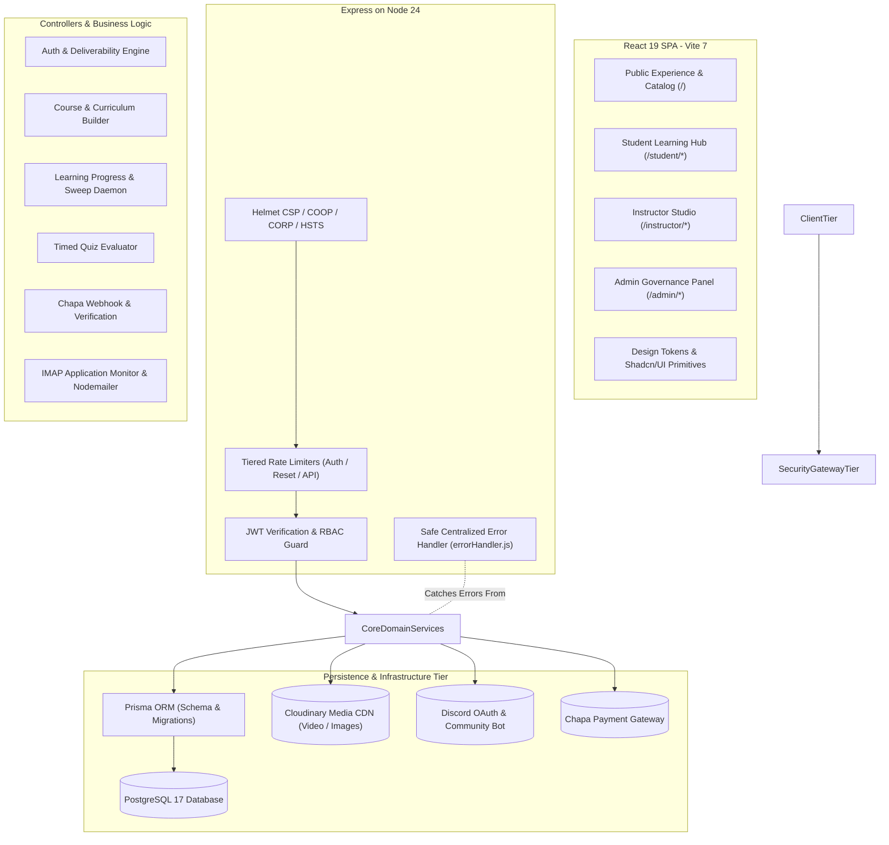
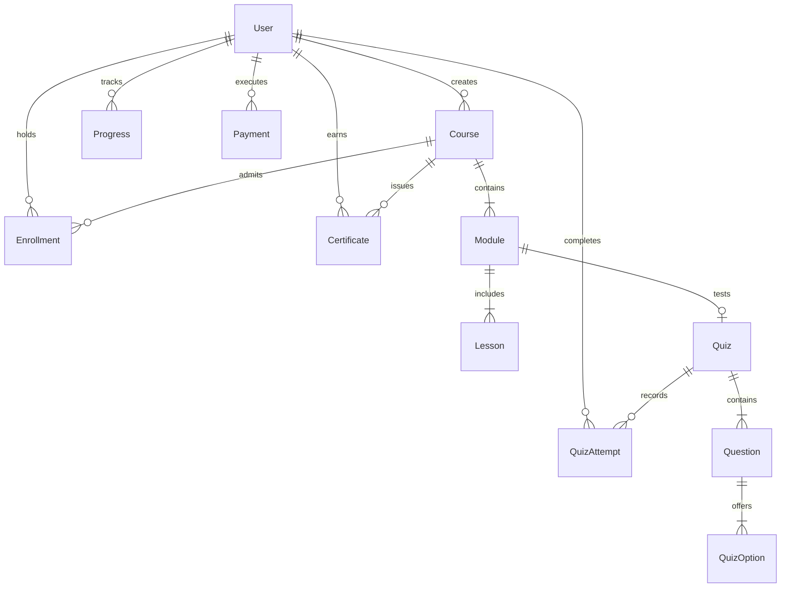

# System Architecture & Code Design Document

> **Platform**: Qatan E-Learning & Online Academy  
> **Repository**: [https://github.com/nathanzerfu-B/Qatan-E-Learning-Platform](https://github.com/nathanzerfu-B/Qatan-E-Learning-Platform)  
> **Author**: Nathan Zerfu  
> **Stack**: React 19 + Vite 7 (Frontend) | Node.js + Express + Prisma (Backend) | PostgreSQL 17 (Database)

---

## 1. High-Level Architectural Topology

Qatan is engineered around a decoupled, multi-tier client-server architecture designed for high availability, modular maintenance, and zero secret leakage.



---

## 2. Decoupled Portals & Client Architecture

The frontend is structured into four autonomous user experiences managed via client-side routing and protected route guards:

| Subsystem | Root Route | Primary Responsibilities | Key Technologies |
| :--- | :--- | :--- | :--- |
| **Public Experience** | `/` | Course catalog filtering, landing page showcase, user authentication, 6-digit OTP verification, instructor application. | React Router, Axios, `PasswordStrengthMeter` |
| **Student Hub** | `/student/*` | Custom video player with playback memory, curriculum accordions, real-time progress bars, timed quizzes, certificate issuance. | HTML5 Video API, LocalStorage state, Canvas certificates |
| **Instructor Studio** | `/instructor/*` | Hierarchical curriculum editor (Modules $\to$ Lessons $\to$ Quizzes), Cloudinary media uploader, student enrollment audit, revenue tracking. | Drag/drop uploads, FormData, Multipart streams |
| **Admin Panel** | `/admin/*` | Instructor vetting queue, course approval workflow, transaction ledger, user suspension controls, system analytics. | Metric cards, Recharts, Audit logs |

---

## 3. Backend Clean Architecture & Code Design

The backend enforces strict separation of concerns across distinct architectural layers:

```text
qatan-backend/src/
├── controllers/          # Business logic, request processing, DB mutations
├── middleware/           # Cross-cutting concerns (Security, Auth, RBAC, Errors)
│   ├── authMiddleware.js     # JWT extraction & requireRole RBAC guard
│   ├── errorHandler.js       # Centralized error mapping, ApiError, asyncHandler
│   └── securityMiddleware.js # Helmet security headers & rate limiters
├── routes/               # Declarative endpoint definitions mapped to controllers
├── utils/                # Integrations (Cloudinary, Email, Deliverability, Discord)
├── prisma/               # Database models, relations, and migration history
└── server.js             # Express application bootstrapping & daemon start
```

### Layered Responsibility Principles:
1. **Routes Layer (`routes/`)**: Contains zero business logic. Strictly maps URL patterns, applies route-specific middlewares, and binds controller functions.
2. **Middleware Layer (`middleware/`)**:
   - `authMiddleware.js`: Validates bearer tokens and enforces role-based access (`requireRole("admin", "instructor")`).
   - `securityMiddleware.js`: Enforces Content Security Policy, Cross-Origin Isolation, and prevents brute-force traffic.
   - `errorHandler.js`: Intercepts uncaught exceptions, normalizes status codes, and sanitizes stack traces.
3. **Controllers Layer (`controllers/`)**: Encapsulates all domain workflows and database operations via Prisma ORM. Wrapped with `asyncHandler` to eliminate unhandled promise rejections.
4. **Services & Utilities (`utils/`)**: Standalone drivers for third-party APIs (Cloudinary video transformations, Chapa payment verifications, IMAP email parsing).

---

## 4. Database Domain Model (Prisma ORM)

The relational schema coordinates 12 core models within PostgreSQL:



### Core Entities:
- **`User`**: Role-based entity (`student`, `instructor`, `admin`) with verified email flags and passkey tracking.
- **`Course`**: Root curriculum entity with approval status lifecycle (`draft`, `pending`, `published`, `rejected`).
- **`Module` & `Lesson`**: Hierarchical content blocks supporting video streaming URLs and sequence ordering.
- **`Quiz` & `QuizAttempt`**: Evaluation engine with configurable passing thresholds (default 40%) and timed attempts.
- **`Enrollment` & `Payment`**: Transaction records linking student access rights to Chapa transaction references (`tx_ref`).

---

## 5. Security & Defensive Engineering

1. **Enterprise HTTP Headers**:
   - **CSP**: Restricts script execution to same-origin while whitelisting Google Fonts, Chapa checkout, and Cloudinary streams.
   - **COOP & CORP**: Configured to `same-origin-allow-popups` and `cross-origin` to allow third-party OAuth popups without sacrificing isolation.
   - **HSTS**: `max-age=31536000; includeSubDomains; preload` ensures HTTPS transport.
2. **Layered Rate Limiting**:
   - `authLimiter`: 10 requests / 15 minutes on login/registration.
   - `passwordResetLimiter`: 5 requests / 15 minutes on OTP dispatch.
   - `generalApiLimiter`: 200 requests / minute on general API traffic.
3. **Password Security**:
   - Minimum 8 characters, alphanumeric + symbols enforced at both client and server tiers.
   - Live interactive strength meter (`PasswordStrengthMeter.jsx`) providing instant feedback.
4. **Safe Error Masking**:
   - Suppresses internal Prisma SQL representations and server file paths from client payloads in production.
   - Returns standardized `{ success: false, message: "..." }` schemas.

---

## 6. Testing & Quality Assurance Architecture

Qatan adopts Node.js's native test runner (`node --test`), providing sub-second test execution without third-party runner overhead:

- **Security Suite** ([`test/security.test.js`](file:///c:/Users/Natha/Desktop/Qatan/qatan-backend/test/security.test.js)): Tests password complexity bounds, empty inputs, and deliverability DNS resolution.
- **Error Handler Suite** ([`test/errorHandler.test.js`](file:///c:/Users/Natha/Desktop/Qatan/qatan-backend/test/errorHandler.test.js)): Tests JWT invalidation, Multer file limits, Prisma `P2002`/`P2025`/`P1001` error handling, and production masking.
- **Continuous Validation**:
  ```bash
  cd qatan-backend && npm test
  # 20/20 Passing tests in ~800ms
  ```
